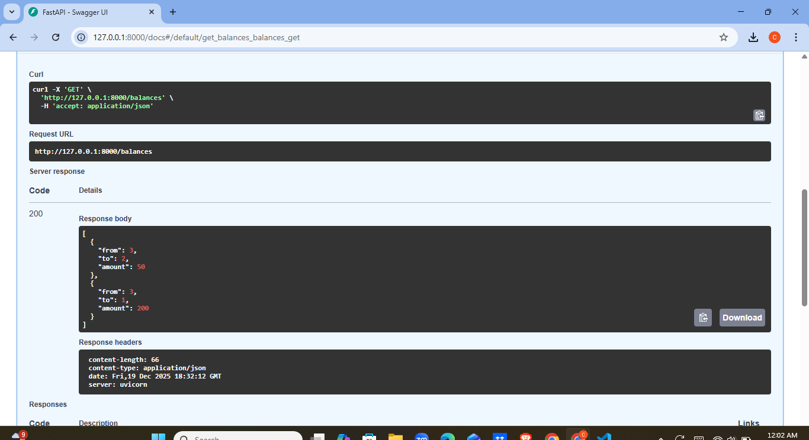
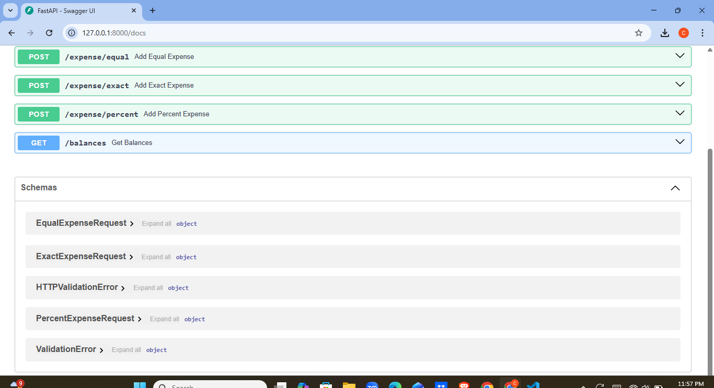
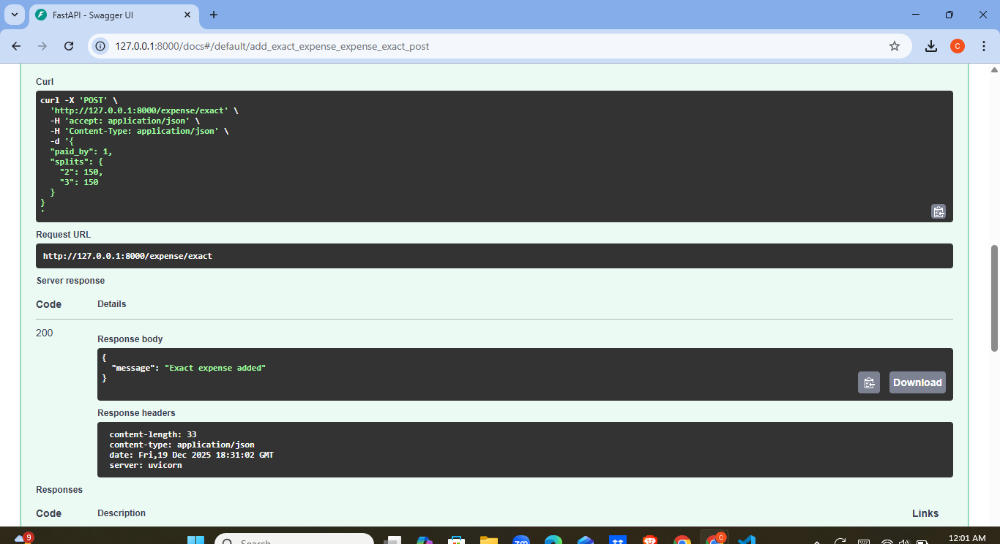
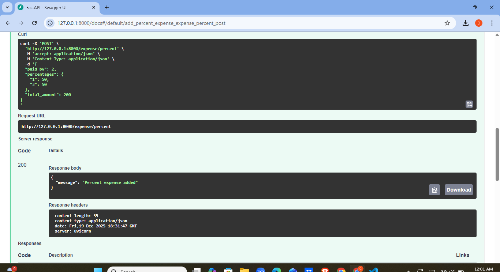
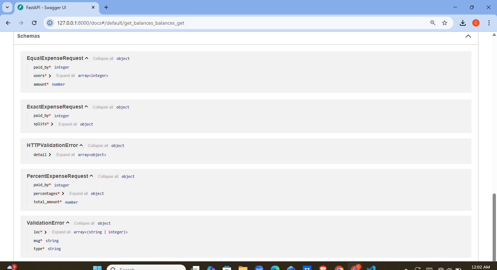

# Expense Sharing Backend (Splitwise-like)

This project is a backend system for an expense sharing application similar to Splitwise.
It was developed as part of a campus placement design assignment for CredResolve.

The system focuses on backend architecture, business logic, and API design for managing
shared expenses and simplified balance settlements.

---

## 🚀 Features

- Create shared expenses between users
- Supported split types:
  - Equal split
  - Exact amount split
  - Percentage split
- Track who owes whom
- Automatically simplify balances to minimize transactions
- RESTful APIs with interactive Swagger documentation

---

## 🛠️ Tech Stack

- Language: Python
- Framework: FastAPI
- Server: Uvicorn
- API Documentation: Swagger (OpenAPI)

---

## 📌 API Endpoints

### Add Expenses
- `POST /expense/equal` – Add an equal split expense
- `POST /expense/exact` – Add an exact amount split expense
- `POST /expense/percent` – Add a percentage split expense

### View Balances
- `GET /balances` – View simplified balances (who owes whom)

---

## 🧪 API Testing (Swagger)

Once the server is running, APIs can be tested using Swagger UI:

## How to Run Locally
pip install -r requirements.txt  
uvicorn main:app --reload

Swagger UI available at:
http://127.0.0.1:8000/docs

## Screenshots

